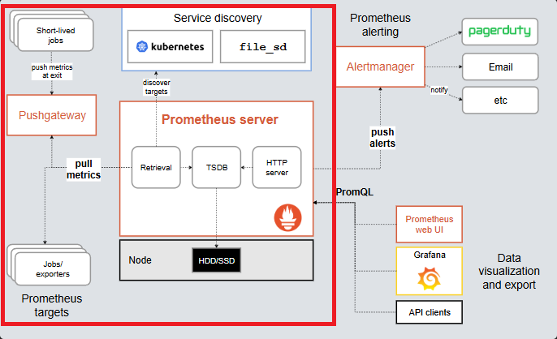

# How Prometheus Works To Collect Metrics for Grafana Curiosity Report

## Introduction

As we were working on the deliverables for metrics collection in Grafana, it was mentioned a couple of times that we were also using a tool called `Prometheus` to help collect some of those metrics. While Grafana mainly allows us to craft visualizations for our metrics, I was curious how `Prometheus` actually works in depth to collect the metrics needed to create those visualizations. In this report, I will talk about how `Prometheus` really works in depth, why it is important, an example of using `Prometheus` separately from Grafana, and more. 

## Prometheus Overview

While Prometheus and Grafana are used heavily together, they are both separate open source tools used together. Prometheus, which was originally developed at SoundCloud, is a tool that helps developers monitor their system and create alerts based on things that happen in their system. Prometheus stores data collected with a timestamp and labels on its own servers/databases, and has become a great tool for developers to use. In order to collect these metrics, they consistently scrape data from your application so that the metrics collected are up to date and readily available.

Main Features of Prometheus:

- Has a multi-dimensional data model for metrics. Data is identified by metric name and has key/value pairs along with time stamps to make a time series data
- Prometheus comes with its own query language to grab metrics effectively called PromQL (which Grafana leverages)
- Prometheus does not rely on distributed systems to store metrics. Their server nodes are "autonomous" and stores data directly on the disk of these server nodes. This makes setting up and collecting metrics easier and simpler
- Metrics are mainly collected through a "Pull" model. This is done through HTTP, mainly, consistently grabbing data from your application
- Offers multiple ways to visualize metrics (We will test Prometheus' own visualizations to see what Prometheus as a whole has to offer)

## Prometheus Architecture


*High-level architecture overview of the Prometheus monitoring system from Prometheus documentation. Highlighted in red is what we are focusing on*

## Experiment

I set up a simple express application with a couple of basic endpoints, similar to setups used for some of the instruction in class. I then used a open source library, `prom-client`, which is a Prometheus client library for Node.js applications to help collect metrics from Node.js applications, to collect those metrics locally.

### Setup
1. Create a new directory and install express
```sh
mkdir prometheusExample && cd prometheusExample
npm init -y
npm install express
```
2. Make the scripts for running the application
```json
"scripts": {
  "start": "node index.js"
},
```
3. Install the Prometheus Client Library
```sh
npm install prom-client
```
4. Create an index.js file and add the code for a simple web app
```js
const express = require('express');
const client = require('prom-client');

const app = express();

// Prometheus Client Stuff
const register = new client.Registry();
client.collectDefaultMetrics({ register });
const taskCounter = new client.Counter({
  name: 'service_tasks_total',
  help: 'Total number of processed tasks',
  label_names: ['status']
});
register.registerMetric(taskCounter);

//Random endpoint
app.get('/process/:status', (req, res) => {
  const { status } = req.params; // e.g., 'success' or 'failure'

  //Metric collection here
  taskCounter.inc({ status }); 
  
  res.send(`Task processed with status: ${status}`);
});

//Endpoint where our metrics will live
app.get('/metrics', async (req, res) => {
  res.setHeader('Content-Type', register.contentType);
  res.send(await register.metrics());
});

app.listen(3000, () => {
  console.log('Service running on http://localhost:3000');
  console.log('Prometheus metrics available at http://localhost:3000/metrics');
});
```
5. Create a prometheus.yml file to configurate the data collection
```yml
global:
  scrape_interval: 5s # Scrape every 5 seconds for the experiment

scrape_configs:
  - job_name: 'pizza-service'
    static_configs:
      - targets: ['host.docker.internal:3000']
```
6. Create a docker-compose.yml to run a temporary Prometheus server
```yml
services:
  prometheus:
    image: prom/prometheus
    ports:
      - "9090:9090"
    volumes:
      - ./prometheus.yml:/etc/prometheus/prometheus.yml
    command:
      - --config.file=/etc/prometheus/prometheus.yml

```

### Running and collecting metrics
1. Run the application
```sh
npm start
```
2. In a separate terminal run this command to start running a seperate Prometheus server that will pull from our /metrics endpoint
```sh
docker compose up
```
> [!NOTE]
> Make sure you have docker desktop downloaded and running!

3. Call the endpoints to add some metrics, call the below however many times as you would like
```
curl http://localhost:3000/process/success 
```
```
curl http://localhost:3000/process/failure
```
4. View the metrics

- You will be able to view the metrics from our running server endpoint in the browser:
```
http://localhost:3000/metrics
```
Where you can scroll down to the bottom of the page and see the metric that we specifically created

- Or on the separate server Prometheus offers:
```
http://localhost:9090
```
Where you can then query specific metrics such as the one we created called
```
service_tasks_total
```
On a nicer looking UI!

For either options, you will be able to see your metrics collected!


